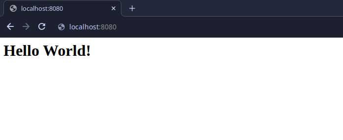

Quickstart
==========

Installation
------------
PigeonPost is available on:
 * PiPy

To install from PiPy, run::

    $ python3 -m pip install pigeonpost

Getting Started
---------------
With pigeon installed, we can create a simple working web application like::

    from pigeon import Pigeon
    app = Pigeon()

    @app.view('/')
    def home(request):
        return '<h1>Hello World!</h1>'

Now, let's proceed to run our application with the following command::

    $ python3 app.py

    INFO     [PIGEON]            STARTING..
    INFO     [PIGEON]            STARTING SERVER
    INFO     [SERVER]            STARTING...
    INFO     [SERVER]            ADDRESS: ANY
    INFO     [SERVER]            PORT: 8080
    INFO     [HANDLER]           REQUEST: /

When we now visit the page at http://my-app:8080/, we should be greeted with a welcoming message:

