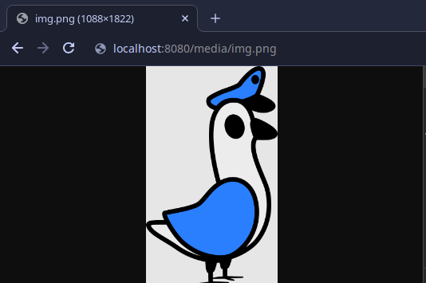
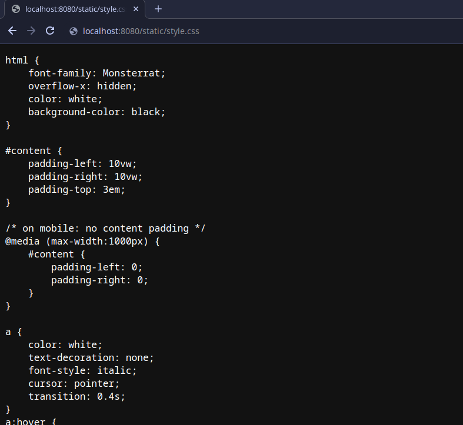

Tutorial
========

Views
-----
Views are functions that correspod to a certain request pawth or route on the web application.
The view \'\/welcome\' could be requested by visiting the url *http://my-app:8080/welcome*

Typing
******
Pigoen supports typing of views.
This a allows us to add a return `mimetype <https://developer.mozilla.org/en-US/docs/Web/HTTP/Basics_of_HTTP/MIME_types>`_ which will be used for server-driven content negotiation.
Essentially, this enables us to allow the client to specify the desired mimetype for the server response.

    While typing is supported by pigeon, it is not required.
    Views that do not specify a mimetype will default to \*/\* (any mimetype).

Untyped Views
*************
Any view with the mimetype \*/\* is considered untyped.
Untyped views are expected to return either *HTTPResponse* objects or strings::

    from pigeon import Pigeon
    Pigeon()

    @Pigeon.view('/')
    def home(request):
        return '<h1>Hello World!</h1>'

    @Pigeon.view('/welcome')
    def welcome(request):
        return HTTPResponse(data='Welcome!')

Typed Views
***********
To make a view typed, we can add the mimetype of our view as the second argument for `Pigeon.view`.
Pigeon will automatically select the most fitting typed view for any incoming the request::

    from pigeon.shortcuts import HTTPResponse
    import json

    @Pigeon.view('/api/test', 'application/json')
    def api_test(request):
        return HTTPResponse(data=json.dumps({'Hello':'World!'}))

    @Pigeon.view('/api/test', 'text/plain')
    def api_test(request):
        return HTTPResponse(data='Hello World!')

Unlike regular views, typed views offer automatic conversion of return data into *HTTPResponse* objects.
This means that a view with the mimetype application/json can effortlessly return any JSON-compatible data, including dictionaries, lists, and more::

    @Pigeon.view('/api/test', 'application/json')
    def api_test(request):
        return {'this data is':'autoconverted to an HTTPResponse object'}

If we need to retrieve data provided in the request, we can utilize the get, data, and files *ParameterDicts*::

    @Pigeon.view('/api/test', 'text/html')
    def api_test(request):
        match request.method:
            case 'GET':
	           return f'<h1>Your name must be {request.get.username}</h1>'
            case 'POST':
	           return f'<h1>Your name must be {request.post.username}</h1>'
        return HTTPResponse(data='method not allowed', status=405)

Dynamic Path Arguments
**********************
Additionally, Pigeon supports dynamic path arguments, which enable requests to include arguments within the path.
Dynamic path arguments are denoted in the path by being enclosed in double curly brackets and can be accessed via an additional dynamic_params argument.
This is best demonstrated through an example::

    @Pigeon.view('/api/user/{{param1}}/view')
    def api_view_user(request, dynamic_params):
        match request.method:
            case 'GET':
                print(f'The user is {dynamic_params.param1}')
                return f'<h1>You requested to view {dynamic_params.param1}!</h1>'
        return HTTPResponse(data='method not allowed', status=405, content_type='text/plain')

Error Responses
***************
Crafting error responses manually can be a time-consuming task. To simplify this process, Pigeon offers a built-in function that automatically generates error responses based on the provided status code::

    from pigeon.shortcuts import error

    @Pigeon.view('/api/user/{{param1}}/view')
    def api_view_user(request, dynamic_params):
        if request.method == 'GET':
            print(f'The user is {dynamic_params.param1}')
            return f'<h1>You requested to view {dynamic_params.param1}!</h1>'
        else:
            # method not allowed
            return error(405)

Overriding default Error Responses
**********************************
When calling the error function, Pigeon will try to locate a matching error view to generate the response.
In case no error view matches the provided status code, a fallback will be invoked. When in debug mode the default
fallback error view will return additional information such as a traceback of the exception.

Error views closely resemble regular untyped views.
We have the ability to define our own custom error view using app.error::

    @Pigeon.error(500)
    def internal_server_error(request):
	   return '<h1>Internal Server Error 500</h1>'

The error fallback is set to match the unused status code 0.
Similar to any other error view, the default fallback error view can also be overridden::

    @Pigeon.error(0)
    def fallback_error(request, code):
        return f'<h1>No error view exists. error: {code}</h1>'

Authentication
**************
To implement authentication, you can easily specify the desired authentication type in the auth parameter of the app.view function.
This allows you to define the specific authentication mechanism you wish to utilize for the view::

    @Pigeon.view('/credential_test/', 'text/html', 'Basic')
    def credential_test(request):
        return f'<h1> Username: {request.auth.username} </h1> <h1> Password: {request.auth.password} </h1>'

Pigeon currently supports the following authentication types:
    * Basic

Cookies
*******
To extract cookies from an *HTTPRequest* object you can simply use the cookies *ParameterDict*::

    @Pigeon.view('/cookies', 'application/json')
    def cookies(request):
        return {"Your SESSION_ID Cookie: ": request.cookies.session_id}

To set a cookie on an *HTTPResponse* object you can either pass a dictionary to the *cookie* argument or set them using the
cookies *ParameterDict*. Setting cookies via the header *ParameterDict* is **not recommended**::

    from pigeon.shortcuts import HTTPResponse

    @Pigeon.view('/set-cookies', 'application/json')
    def set_cookies(request):
        # set through HTTPResponse cookies constructor argument
        response = HTTPResponse('setting cookies', content_type='application/json', cookies={'SESSION_ID':'ABCDEFG'})
        # set through cookies parameter dict
        response.cookies.other_session_id = 'HIJKLMN'

        return response

Working with multiple files
---------------------------

When working with multiple files, remember to initialize Pigeon first and import any other modules using Pigeon afterwards::

    # first pigeon setup
    from pigeon import Pigeon
    import settings

    # initialize Pigeon
    Pigeon(settings)

    # import of other modules
    from pigeon.shortcuts import HTTPResponse, render
    import other_views

    @Pigeon.view('/')
    def authed(request):
        return f'<h1> Hello World </h1>'

Configuring Settings
--------------------
If we wish to modify settings, we can achieve this through the Pigeon class.
We have the option to either override default settings by importing a module, overwrite them using a dictionary, or adjust them individually one by one::

    from pigeon import Pigeon
    from pathlib import Path

    # directory of project
    BASE_DIR = pathlib.Path(__file__).parent.resolve()

    Pigeon()

    # override settings from imported module
    import mysettings
    Pigeon.settings.override(mysettings)

    # override settigns using dictionary
    mysettings_dict = {
        'VERBOSITY':  3,
        'PORT': 3000,
        'STATIC_URL_BASE': '/static/'
        'STATIC_FILES_DIR': BASE_DIR / 'static/'
    }
    Pigeon.settings.override(mysettings_dict)

    # change settings manually
    Pigeon.settings.verbosity = 2
    Pigeon.port = 2556
    Pigeon.static_url_base = '/files/static/'
    Pigeon.static_files_dir = BASE_DIR / 'resources/static/'

The imported settings module should resemble the following::

    # settings.py

    VERBOSITY = 4
    PORT = 8080
    ALLOWED_HOSTS = ['teamsmiley.org']

The recommended approach for overriding default values is to modify the settings as demonstrated above.
Altering settings at runtime is not recommended as it might result in unpredictable and undefined behavior.
Remember to set *DEBUG_MODE* and *CRASH_ON_FAILURE* before deploying to production, as they provide additional security for your application.
A list of all available settings can be found :ref:`here <additional.settings>`.

.. _tutorial.mediafiles:

Media Files
-----------
Media files refer to non-executable files such as images, vides, aufo files, etc., which are used within a web application.
They are primarily intended for user-generated content and should not be employed for crucial files required for the application's frontend.

By configuring the *MEDIA_URL_BASE* and *MEDIA_FILES_DIR* settings we automatically enable media files::

    from pigeon import Pigeon
    from pathlib import Path

    # directory of project
    BASE_DIR = pathlib.Path(__file__).parent.resolve()

    Pigeon()

    # enable staticfiles
    Pigeon.settings.media_url_base = '/media/'
    Pigeon.settings.media_files_dir = BASE_DIR / 'media/'

Let's consider the following project structure::

    .
    ├── app.py
    └── media
        └── img.png

After running the application we can access the img in our media folder under *http://localhost:8080/media/img.png*:

.. _tutorial.staticfiles:

Static Files
------------
Static files should be used for files such as CSS, JavaScript, images, and other assets that are essential for rendering the frontend of a web application.
Unlike media files, static files are typically not user-generated and should remain constant throughout the application's lifespan.
Pigeon will automatically load smaller static files into memory to allow for faster response times.

Much like media files, the handling of static files is effortlessly facilitated by configuring the *STATIC_URL_BASE* and *STATIC_FILES_DIR* settings.
By configuring these settings, static files will be automatically enabled::

    from pigeon import Pigeon
    from pathlib import Path

    # directory of project
    BASE_DIR = pathlib.Path(__file__).parent.resolve()

    Pigeon()

    # enable staticfiles
    Pigeon.settings.static_url_base = '/static/'
    Pigeon.settings.static_files_dir = BASE_DIR / 'static/'

Let's consider the following project structure::

    .
    ├── app.py
    └── static
        └── style.css

When running the application we access the css stylesheet under *http://localhost:8080/static/style.css*:

.. _tutorial.templating:

Templating
----------
Templates serve as pre-defined structures that allow us to dynamically generate HTML content.
They act as placeholders where dynamic data can be inserted before sending a response to a client's request.

Pigeon uses the jinja2 templating engine.
If you want to learn how to make your own templates, the documentation for writing jinja2 templates can be found `here <https://jinja.palletsprojects.com/en/3.1.x/templates/>`_.

To enable templates, we must specify a template directory using the *TEMPLATES_DIR* setting, which will automatically activate them.
It is important to ensure that all our templates are located within this designated directory, as otherwise, Pigeon will not be able to locate them::

    from pigeon import Pigeon
    from pathlib import Path

    # directory of project
    BASE_DIR = pathlib.Path(__file__).parent.resolve()

    Pigeon()

    # configure templates directory
    Pigeon.settings.templates_dir = BASE_DIR / 'templates/'

To make use of the templates we can utilize the *render* function::

    from pigeon.shortcuts import render

    @Pigeon.view('/thisisrendered/')
    def my_rendered_view(request):
        return render('path/to/template.html', context={'request':request})

